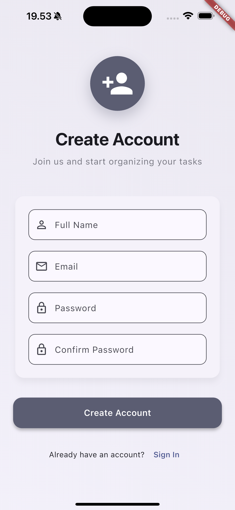

# Task Manager – Flutter App

A **Task management application** built with **Flutter**.  
This project demonstrates **Clean Architecture**, offline-first design, and scalable code practices.

## 📸 Screenshots

### Authentication Flow
| Splash Screen | Login Page | Register Page |
|:---:|:---:|:---:|
|  |  |  |
| Animated splash with auto-login | JWT authentication with validation | User registration form |

### Task Management
| All Tasks | Create Task | Edit Task |
|:---:|:---:|:---:|
|  |  |  |
| Task list with smart sorting | Full task creation form | Edit existing tasks |

### Filtering & Search
| Todo Filter | Search Filter |
|:---:|:---:|
|  |  |
| Status-based filtering | Real-time search functionality |

---

## Features
- **Authentication System**
  - JWT-based secure authentication with REST API
  - Splash screen with smooth animations and auto-login
  - Login & Register with form validation
  - Modern UI with gradient backgrounds
  - BLoC state management for auth flow
  - Secure token storage with Hive

- **Advanced Task Management**
  - Create, edit, delete tasks with full CRUD operations
  - Task properties: Title, Description, Status, Priority, Due Date
  - Status tracking: *To Do / In Progress / Done*
  - Priority levels: *Low / Medium / High*
  - Due date management with overdue detection

- **Smart Filtering & Search**
  - Real-time search across title and description
  - Status-based filtering with visual chips
  - Smart sorting: overdue first, then priority, then due date
  - Combined filters work seamlessly together

- **Task Analytics**
  - Clean overview dashboard with task counts
  - Visual priority indicators and status badges
  - Overdue task warnings and due soon alerts

- **Offline-First Architecture**
  - Full offline functionality with Hive local database
  - Automatic API synchronization when online
  - Version-based schema migration system
  - Data persistence across app restarts
  - Graceful fallback when API is unavailable

- **Modern UI/UX**
  - Material 3 design system
  - Smooth animations and transitions
  - Swipe-to-delete with confirmation
  - Responsive design with proper accessibility

- **Clean Architecture**
  - Domain-driven design with clear layer separation
  - BLoC state management pattern for both Auth & Tasks
  - Dependency injection with GetIt
  - Comprehensive test coverage with mocktail
  - SOLID principles and scalable codebase
  - Real-time sync indicators during API operations

---

## Project Structure

```
task_manager/
├── lib/
│   ├── core/                           # Shared utilities & infrastructure
│   │   ├── di/
│   │   │   └── injection_container.dart    # Dependency injection setup
│   │   ├── error/
│   │   │   └── failures.dart              # Error handling classes
│   │   ├── network/
│   │   │   └── http_client.dart           # HTTP client configuration
│   │   └── storage/
│   │       └── token_storage.dart         # Secure token storage
│   ├── features/
│   │   ├── auth/                       # Authentication feature module
│   │   │   ├── data/
│   │   │   │   ├── datasources/
│   │   │   │   ├── models/
│   │   │   │   └── repositories/
│   │   │   ├── domain/
│   │   │   │   ├── entities/
│   │   │   │   ├── repositories/
│   │   │   │   └── usecases/
│   │   │   └── presentation/
│   │   │       ├── bloc/
│   │   │       └── pages/
│   │   └── tasks/                      # Task management feature module
│   │       ├── data/
│   │       │   ├── datasources/
│   │       │   ├── models/
│   │       │   └── repositories/
│   │       ├── domain/
│   │       │   ├── entities/
│   │       │   ├── repositories/
│   │       │   └── usecases/
│   │       └── presentation/
│   │           ├── bloc/
│   │           ├── pages/
│   │           └── widgets/
│   └── main.dart                       # App entry point
├── backend/                            # REST API server (Node.js)
├── test/                               # Test files
├── screenshots/                        # App screenshots
├── pubspec.yaml                        # Flutter dependencies
└── README.md                           # Project documentation
```

## Architecture & Technical Choices

This app follows **Clean Architecture** with strict separation of concerns and SOLID principles.

### **Layer Responsibilities:**
- **Domain Layer**: Business logic, entities, use cases, repository interfaces
- **Data Layer**: Repository implementations, data sources (local Hive + remote API)
- **Presentation Layer**: UI components, BLoC state management, pages & widgets

### Key Technical Choices

**1. Clean Architecture**
- **Why**: Ensures testability, maintainability, and scalability
- **Implementation**: Strict layer separation with dependency inversion
- **Benefits**: Easy to test, modify, and extend features

**2. BLoC State Management**
- **Why**: Predictable state management with clear separation of business logic
- **Implementation**: Separate BLoCs for Auth and Tasks with event-driven architecture
- **Benefits**: Testable, reactive, and follows Flutter best practices

**3. Offline-First Architecture**
- **Why**: Ensures app works without internet connectivity
- **Implementation**: Hive local database with background API synchronization
- **Benefits**: Better user experience and data persistence

**4. Dependency Injection (GetIt)**
- **Why**: Loose coupling and easier testing
- **Implementation**: Service locator pattern with lazy initialization
- **Benefits**: Mockable dependencies and cleaner code

**5. Repository Pattern**
- **Why**: Abstract data sources and enable offline-first approach
- **Implementation**: Single repository with multiple data sources (local + remote)
- **Benefits**: Flexible data management and easy testing

### Technical Stack
**Frontend (Flutter)**
- **Flutter** – Cross-platform UI framework
- **State Management** – BLoC pattern with flutter_bloc
- **Local Database** – Hive for offline-first data persistence
- **Architecture** – Clean Architecture with clear layer separation
- **Testing** – Unit tests with mocktail, BLoC tests, Widget tests
- **UI/UX** – Material 3 design system with custom animations
- **Navigation** – Flutter's built-in navigation with custom transitions

**Backend (REST API)**
- **Node.js & Express** – RESTful API server
- **JWT Authentication** – Secure user authentication with middleware
- **User Isolation** – Tasks are user-specific with proper authorization
- **In-memory Storage** – Simple data persistence (easily replaceable with database)
- **CORS Support** – Cross-origin resource sharing for Flutter app
- **Request Logging** – Debug-friendly API operation tracking  

---

## Setup Instructions

### Prerequisites
- **Flutter SDK**: 3.0.0 or higher
- **Dart SDK**: 2.17.0 or higher
- **Node.js**: 16.0.0 or higher (for backend)
- **IDE**: VS Code, Android Studio, or IntelliJ IDEA
- **Device**: Android/iOS device or emulator

### 1. Clone the Repository
```bash
git clone https://github.com/uta-praditya/task_manager.git
cd task_manager
```

### 2. Flutter App Setup
```bash
# Install dependencies
flutter pub get

# Generate Hive type adapters
flutter packages pub run build_runner build

# Run the app
flutter run
```

### 3. Backend Setup (Optional)
The app works offline-first, but you can run the REST API for server synchronization:

```bash
cd backend
npm install
npm run dev  # Development server on port 3000
```

### 4. Running Tests
```bash
# Run all tests
flutter test

# Run tests with coverage
flutter test --coverage

# Generate coverage report
genhtml coverage/lcov.info -o coverage/html
```

### 5. Building for Production
```bash
# Android APK
flutter build apk --release

# Android App Bundle
flutter build appbundle --release

# iOS
flutter build ios --release
```

## How to Use the App

### Authentication
1. **Splash Screen**: Auto-login if token exists
2. **Login**: Enter any valid email and password (demo mode)
3. **Register**: Create new account with email/password
4. **Logout**: Clear data and return to login

### Task Management
1. **View Tasks**: See all tasks with smart sorting (overdue first)
2. **Create Task**: Tap + button, fill details, select priority/status
3. **Edit Task**: Tap on any task to modify details
4. **Delete Task**: Swipe left on task item
5. **Search**: Use search icon to find tasks by title/description
6. **Filter**: Use status chips to filter by To Do/In Progress/Done

### Offline Mode
- App works fully offline with local Hive database
- Data syncs automatically when internet is available
- Sync indicators show when API operations are in progress

## API Integration

**Authentication Flow:**
- JWT tokens stored securely in Hive
- Automatic token inclusion in API requests
- User-specific data isolation

**Sync Strategy:**
- **Offline-First**: Local data loads immediately
- **Background Sync**: API sync when connectivity available
- **Conflict Resolution**: Local data takes precedence
- **Visual Indicators**: Sync status shown in UI

## Features Showcase

### **Clean Architecture Benefits:**
- **Testable**: Each layer can be tested independently
- **Maintainable**: Clear separation of concerns
- **Scalable**: Easy to add new features
- **Flexible**: Can swap data sources without affecting business logic

### **BLoC Pattern Implementation:**
- **AuthBloc**: Handles login, register, logout, auth status
- **TaskBloc**: Manages CRUD operations with sync states
- **Event-Driven**: Clear separation between UI events and business logic
- **State Management**: Predictable state transitions

### **Offline-First Design:**
- **Immediate Response**: UI updates instantly with local data
- **Smart Sync**: Background synchronization with conflict resolution
- **Graceful Degradation**: Full functionality without internet
- **Data Persistence**: Hive database with schema migrations

---

## 🚀 CI/CD Pipeline

This project includes automated CI/CD with GitHub Actions:

### Automated Workflows
- **Code Quality**: Linting and formatting checks
- **Testing**: Automated test execution with coverage reports
- **Build**: APK generation for releases
- **Coverage**: Integration with Codecov for test coverage tracking

### Pipeline Stages
1. **Analysis**: `flutter analyze` and `dart format`
2. **Testing**: `flutter test --coverage`
3. **Build**: `flutter build apk --release`
4. **Artifacts**: Upload APK and coverage reports

---

## 📐 Architecture Documentation

Detailed architecture documentation is available in [`/docs/architecture.md`](./docs/architecture.md):

- **Clean Architecture Diagrams**: Visual representation of layer separation
- **State Management Flow**: BLoC pattern implementation details
- **Offline-First Strategy**: Data synchronization approach
- **Design Decisions**: Technical choices and their rationale
- **Future Scalability**: Extension points for new features
